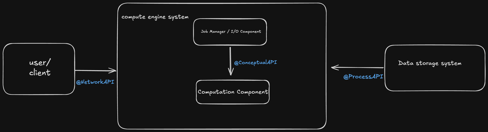

## Computation Description
Part 1

This computation processes a single positive integer N to find the largest prime number strictly smaller than N and calculates the total count of prime numbers up to N using iterative primality testing.

-Input: A single positive integer N (ex, 100).
-computation: Iterates through numbers from 2 up to N, performing primality checks to tally all prime numbers and identify the maximum prime value less than N.
-Output: The input integer followed by the largest prime found and the total prime count.
-Example: input of '100' Output: 100:largest_prime=97,total_primes=25

Part 2

